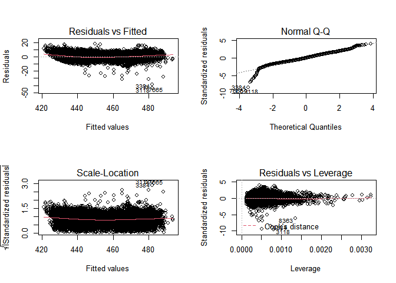
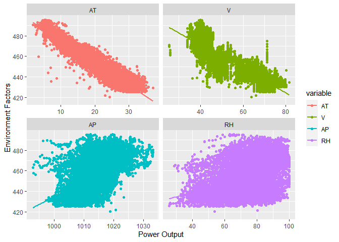
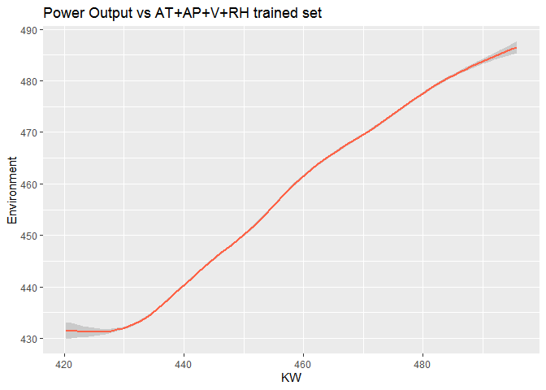
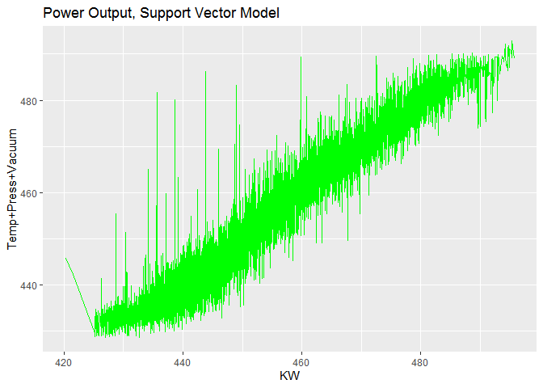

PowerPlant
================
Robert Erdman
October 8, 2020

    ## 
    ## Attaching package: 'dplyr'

    ## The following objects are masked from 'package:stats':
    ## 
    ##     filter, lag

    ## The following objects are masked from 'package:base':
    ## 
    ##     intersect, setdiff, setequal, union

    ## Package 'sm', version 2.2-5.6: type help(sm) for summary information

    ## Loading required package: carData

    ## 
    ## Attaching package: 'car'

    ## The following object is masked from 'package:dplyr':
    ## 
    ##     recode

Sample splitting

Linear regression

    ## 
    ## Call:
    ## lm(formula = PE ~ (AT + AP + RH), data = Cycle_pwrE)
    ## 
    ## Residuals:
    ##     Min      1Q  Median      3Q     Max 
    ## -44.039  -3.305   0.017   3.244  20.519 
    ## 
    ## Coefficients:
    ##               Estimate Std. Error  t value Pr(>|t|)    
    ## (Intercept) 490.323746  10.193478   48.102   <2e-16 ***
    ## AT           -2.377708   0.009328 -254.912   <2e-16 ***
    ## AP            0.025372   0.009882    2.568   0.0103 *  
    ## RH           -0.203832   0.004123  -49.441   <2e-16 ***
    ## ---
    ## Signif. codes:  0 '***' 0.001 '**' 0.01 '*' 0.05 '.' 0.1 ' ' 1
    ## 
    ## Residual standard error: 4.798 on 9564 degrees of freedom
    ## Multiple R-squared:  0.921,  Adjusted R-squared:  0.921 
    ## F-statistic: 3.717e+04 on 3 and 9564 DF,  p-value: < 2.2e-16

    ## [1] 57166.61

From correl we see that AT and V are strongest predictors of PE.
However, there may be a strong interaction effect between V and AT.
Let’s try again:

    ##            AT          V          AP          RH         PE
    ## AT  1.0000000  0.8441067 -0.50754934 -0.54253465 -0.9481285
    ## V   0.8441067  1.0000000 -0.41350216 -0.31218728 -0.8697803
    ## AP -0.5075493 -0.4135022  1.00000000  0.09957432  0.5184290
    ## RH -0.5425347 -0.3121873  0.09957432  1.00000000  0.3897941
    ## PE -0.9481285 -0.8697803  0.51842903  0.38979410  1.0000000

We try different combinations of dependent variables:

    ## 
    ## Call:
    ## lm(formula = PE ~ (AT + V + AP + RH), data = Cycle_pwrE)
    ## 
    ## Residuals:
    ##     Min      1Q  Median      3Q     Max 
    ## -43.435  -3.166  -0.118   3.201  17.778 
    ## 
    ## Coefficients:
    ##               Estimate Std. Error  t value Pr(>|t|)    
    ## (Intercept) 454.609274   9.748512   46.634  < 2e-16 ***
    ## AT           -1.977513   0.015289 -129.342  < 2e-16 ***
    ## V            -0.233916   0.007282  -32.122  < 2e-16 ***
    ## AP            0.062083   0.009458    6.564 5.51e-11 ***
    ## RH           -0.158054   0.004168  -37.918  < 2e-16 ***
    ## ---
    ## Signif. codes:  0 '***' 0.001 '**' 0.01 '*' 0.05 '.' 0.1 ' ' 1
    ## 
    ## Residual standard error: 4.558 on 9563 degrees of freedom
    ## Multiple R-squared:  0.9287, Adjusted R-squared:  0.9287 
    ## F-statistic: 3.114e+04 on 4 and 9563 DF,  p-value: < 2.2e-16

    ## [1] 56188.23

    ## 
    ## Call:
    ## lm(formula = PE ~ (AT + V + RH), data = Cycle_pwrE)
    ## 
    ## Residuals:
    ##     Min      1Q  Median      3Q     Max 
    ## -43.745  -3.147  -0.092   3.161  18.047 
    ## 
    ## Coefficients:
    ##               Estimate Std. Error t value Pr(>|t|)    
    ## (Intercept) 518.548925   0.387755 1337.31   <2e-16 ***
    ## AT           -2.018727   0.013971 -144.50   <2e-16 ***
    ## V            -0.228141   0.007245  -31.49   <2e-16 ***
    ## RH           -0.165383   0.004025  -41.09   <2e-16 ***
    ## ---
    ## Signif. codes:  0 '***' 0.001 '**' 0.01 '*' 0.05 '.' 0.1 ' ' 1
    ## 
    ## Residual standard error: 4.568 on 9564 degrees of freedom
    ## Multiple R-squared:  0.9284, Adjusted R-squared:  0.9284 
    ## F-statistic: 4.132e+04 on 3 and 9564 DF,  p-value: < 2.2e-16

    ## [1] 56229.24

    ## 
    ## Call:
    ## lm(formula = PE ~ (AT + V + AP + AT:V), data = Cycle_pwrE)
    ## 
    ## Residuals:
    ##     Min      1Q  Median      3Q     Max 
    ## -45.536  -3.116  -0.004   3.122  18.031 
    ## 
    ## Coefficients:
    ##               Estimate Std. Error t value Pr(>|t|)    
    ## (Intercept)  3.554e+02  9.360e+00   37.97   <2e-16 ***
    ## AT          -2.828e+00  3.517e-02  -80.43   <2e-16 ***
    ## V           -8.793e-01  1.668e-02  -52.73   <2e-16 ***
    ## AP           1.721e-01  9.171e-03   18.77   <2e-16 ***
    ## AT:V         2.429e-02  6.698e-04   36.27   <2e-16 ***
    ## ---
    ## Signif. codes:  0 '***' 0.001 '**' 0.01 '*' 0.05 '.' 0.1 ' ' 1
    ## 
    ## Residual standard error: 4.584 on 9563 degrees of freedom
    ## Multiple R-squared:  0.9279, Adjusted R-squared:  0.9279 
    ## F-statistic: 3.077e+04 on 4 and 9563 DF,  p-value: < 2.2e-16

    ## [1] 56295.02

    ## 
    ## Call:
    ## lm(formula = PE ~ (AT + V), data = Cycle_pwrE)
    ## 
    ## Residuals:
    ##     Min      1Q  Median      3Q     Max 
    ## -44.354  -3.343  -0.084   3.276  19.849 
    ## 
    ## Coefficients:
    ##               Estimate Std. Error t value Pr(>|t|)    
    ## (Intercept) 505.477434   0.240491 2101.86   <2e-16 ***
    ## AT           -1.704266   0.012678 -134.43   <2e-16 ***
    ## V            -0.324487   0.007435  -43.64   <2e-16 ***
    ## ---
    ## Signif. codes:  0 '***' 0.001 '**' 0.01 '*' 0.05 '.' 0.1 ' ' 1
    ## 
    ## Residual standard error: 4.955 on 9565 degrees of freedom
    ## Multiple R-squared:  0.9157, Adjusted R-squared:  0.9157 
    ## F-statistic: 5.197e+04 on 2 and 9565 DF,  p-value: < 2.2e-16

    ## [1] 57782.86

We pick model 2 based largely on AIC and RSE.
<!-- -->

Now we attempt all-subsets regression

``` r
#this will not run in knitr sorry.  see orginal R file to run this
```

Some diagnostic summary statistics here

``` r
anova(Cycle_Output2)
```

    ## Analysis of Variance Table
    ## 
    ## Response: PE
    ##             Df  Sum Sq Mean Sq   F value    Pr(>F)    
    ## AT           1 2505095 2505095 120563.32 < 2.2e-16 ***
    ## V            1   46766   46766   2250.72 < 2.2e-16 ***
    ## AP           1    6259    6259    301.23 < 2.2e-16 ***
    ## RH           1   29875   29875   1437.81 < 2.2e-16 ***
    ## Residuals 9563  198702      21                        
    ## ---
    ## Signif. codes:  0 '***' 0.001 '**' 0.01 '*' 0.05 '.' 0.1 ' ' 1

``` r
vcov(Cycle_Output2)
```

    ##              (Intercept)            AT             V            AP
    ## (Intercept) 95.033487115 -6.259980e-02  8.096491e-03 -9.212852e-02
    ## AT          -0.062599796  2.337542e-04 -9.072452e-05  5.938375e-05
    ## V            0.008096491 -9.072452e-05  5.302899e-05 -8.322289e-06
    ## AP          -0.092128516  5.938375e-05 -8.322289e-06  8.945325e-05
    ## RH          -0.012151090  3.767589e-05 -1.037785e-05  1.056057e-05
    ##                        RH
    ## (Intercept) -1.215109e-02
    ## AT           3.767589e-05
    ## V           -1.037785e-05
    ## AP           1.056057e-05
    ## RH           1.737440e-05

``` r
summary(Cycle_Output2)
```

    ## 
    ## Call:
    ## lm(formula = PE ~ (AT + V + AP + RH), data = Cycle_pwrE)
    ## 
    ## Residuals:
    ##     Min      1Q  Median      3Q     Max 
    ## -43.435  -3.166  -0.118   3.201  17.778 
    ## 
    ## Coefficients:
    ##               Estimate Std. Error  t value Pr(>|t|)    
    ## (Intercept) 454.609274   9.748512   46.634  < 2e-16 ***
    ## AT           -1.977513   0.015289 -129.342  < 2e-16 ***
    ## V            -0.233916   0.007282  -32.122  < 2e-16 ***
    ## AP            0.062083   0.009458    6.564 5.51e-11 ***
    ## RH           -0.158054   0.004168  -37.918  < 2e-16 ***
    ## ---
    ## Signif. codes:  0 '***' 0.001 '**' 0.01 '*' 0.05 '.' 0.1 ' ' 1
    ## 
    ## Residual standard error: 4.558 on 9563 degrees of freedom
    ## Multiple R-squared:  0.9287, Adjusted R-squared:  0.9287 
    ## F-statistic: 3.114e+04 on 4 and 9563 DF,  p-value: < 2.2e-16

A jitter plot of all factors melted

    ## `geom_smooth()` using formula 'y ~ x'

<!-- --> \#machine
learning

Visualizing the Training set results

Now test-set
    prediction

    ## `geom_smooth()` using method = 'gam' and formula 'y ~ s(x, bs = "cs")'

<!-- --> SVM
support vector machine
<!-- -->

Note that the `echo = FALSE` parameter was added to the code chunk to
prevent printing of the R code that generated the plot.
